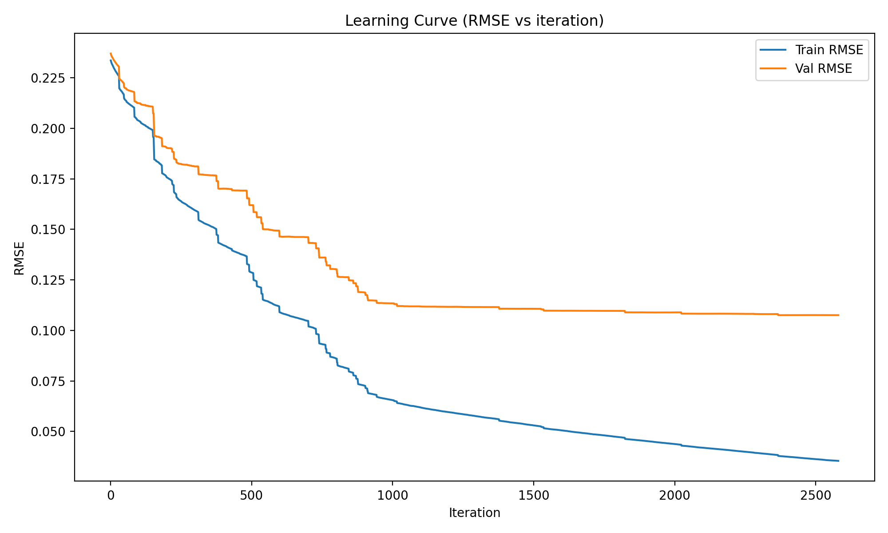
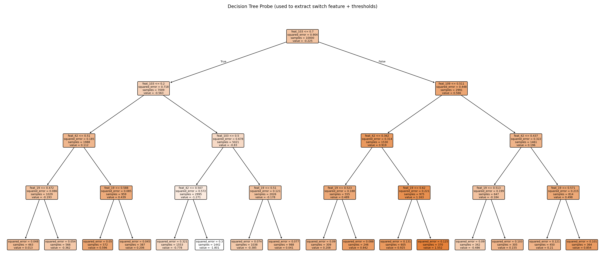

# Machine Learning Challenge – Regression + Rule-Based Edge Deployment

This project implements two complementary prediction systems:

1. **Part 1** – High-performance regression model for continuous target prediction.
2. **Part 2** – Lightweight rule-based inference engine designed for edge deployment without ML libraries.

The project demonstrates both data-driven modeling and interpretable rule extraction under deployment constraints.

---

## Project Overview

The dataset consists of numerical features and two targets:

- `target01` → Continuous variable (regression task)
- `target02` → Deterministic rule-based target

The key objective was not only predictive performance but also understanding model behavior and extracting minimal decision logic for constrained environments.

---

## Part 1 – Regression Model (target01)

### Approach

- Data preprocessing
- Model training using gradient boosting
- Cross-validation monitoring (RMSE)
- Hyperparameter tuning
- Final prediction on evaluation dataset

### Model Behavior

The learning curve shows stable convergence and controlled generalization:



Validation RMSE plateaus while training RMSE continues decreasing — indicating controlled overfitting and strong generalization performance.

### Output

Final predictions are stored in: results/EVAL_target01_4.csv


---

## Part 2 – Rule-Based Framework (target02)

### Objective

Deploy prediction logic on an edge device where:
- No ML libraries are allowed
- Only conditional comparisons and numerical calculations are permitted

### Method

To extract the minimal rule structure:

1. Trained a shallow decision tree as a probe model
2. Identified dominant split features and thresholds
3. Simplified decision paths into compact rule pairs
4. Implemented rules inside provided execution framework

Decision Tree Probe:



The final implementation follows the format:

```python
(condition, calculation_function)


